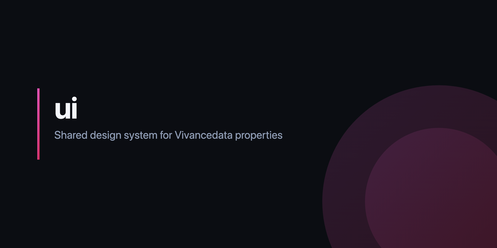

# @vivancedata/ui

<p align="center">
  
</p>

A design system and component library for Vivancedata projects. Built with React, Tailwind CSS, and Radix UI primitives.

## Features

- **Neumorphic Design** -- Soft 3D shadows for that modern, tactile feel
- **Glass Effects** -- Frosted glass/glassmorphism components
- **Dark Mode** -- Full dark mode support with carefully tuned colors
- **Consistent Design Tokens** -- Spacing, typography, colors, and more
- **Accessible** -- Built on Radix UI primitives for a11y compliance
- **Tree-Shakeable** -- Import only what you need
- **Animation System** -- Framer Motion variants for stagger, parallax, reveals, and springs
- **Interactive Effects** -- Magnetic buttons, cursor glow, ripple clicks, and border beam animations

## Installation

```bash
npm install @vivancedata/ui
# or
bun add @vivancedata/ui
# or
pnpm add @vivancedata/ui
```

### Peer Dependencies

The library expects these peer dependencies in your project:

```bash
npm install react react-dom framer-motion tailwindcss
```

| Peer Dependency | Required Version |
|-----------------|-----------------|
| `react` | >= 18.0.0 |
| `react-dom` | >= 18.0.0 |
| `framer-motion` | >= 10.0.0 |
| `tailwindcss` | >= 3.4.0 |

## Setup

### 1. Import the styles

In your root layout or `globals.css`:

```css
@import "@vivancedata/ui/styles";
```

Or import in your root component:

```tsx
import "@vivancedata/ui/src/styles/globals.css";
```

### 2. Configure Tailwind

Extend your `tailwind.config.ts` with the Vivancedata preset:

```ts
import type { Config } from "tailwindcss";
import vivanceConfig from "@vivancedata/ui/tailwind";

const config: Config = {
  presets: [vivanceConfig],
  content: [
    "./src/**/*.{js,ts,jsx,tsx,mdx}",
    "./node_modules/@vivancedata/ui/dist/**/*.{js,mjs}",
  ],
  // Your customizations here
};

export default config;
```

### 3. Add the TooltipProvider

Wrap your app with `TooltipProvider` for tooltips to work:

```tsx
import { TooltipProvider } from "@vivancedata/ui";

export default function App({ children }) {
  return <TooltipProvider>{children}</TooltipProvider>;
}
```

## Quick Start

```tsx
import { Button, Card, CardHeader, CardTitle, CardContent, Badge } from "@vivancedata/ui";

export function MyComponent() {
  return (
    <Card variant="neu">
      <CardHeader>
        <CardTitle>Welcome</CardTitle>
        <Badge variant="success">New</Badge>
      </CardHeader>
      <CardContent>
        <p>This is a neumorphic card with the Vivancedata design system.</p>
        <Button variant="neu-primary">Get Started</Button>
      </CardContent>
    </Card>
  );
}
```

## Component Catalog

### Base Components

| Component | Variants | Description |
|-----------|----------|-------------|
| `Button` | `default`, `destructive`, `outline`, `secondary`, `ghost`, `link`, `neu`, `neu-primary`, `glass`, `glow`, `primary` | Multi-variant buttons with loading state and `asChild` support |
| `Card` | `default`, `outline`, `ghost`, `neu`, `neu-inset`, `glass`, `elevated` | Container cards with neumorphic and glass options |
| `CardHeader`, `CardFooter`, `CardTitle`, `CardDescription`, `CardContent` | -- | Card sub-components for structured content |
| `Badge` | `success`, `warning`, `info`, `muted` | Status badges for labels and indicators |
| `Input` | `default`, `neu`, `glass` | Text inputs with neumorphic and glass variants |
| `Textarea` | `default`, `neu`, `glass` | Multi-line text inputs with matching variants |
| `Label` | -- | Accessible form labels (Radix UI) |
| `Separator` | horizontal, vertical | Horizontal/vertical dividers |

### Glass and Animated Cards

| Component | Variants | Description |
|-----------|----------|-------------|
| `GlassCard` | `default`, `frosted`, `tinted`, `bordered` + hover: `none`, `lift`, `glow`, `scale` | Glassmorphism cards with blur effects and optional gradient overlay |
| `AnimatedCard` | hover: `hover-lift`, `hover-glow`, `hover-tilt`, `hover-border` + bg: `default`, `glass`, `neu` | Cards with mouse-tracking tilt and hover animations |
| `ExpandableCard` | -- | Cards that expand to reveal additional content |

### Layout Components

| Component | Variants | Description |
|-----------|----------|-------------|
| `Container` | size variants | Responsive container with centering |
| `Section` | gradient backgrounds | Page sections with gradient backgrounds |
| `Heading` | gradient support | Typography headings with gradient text option |

### Radix UI Primitives

| Component | Description |
|-----------|-------------|
| `Accordion`, `AccordionItem`, `AccordionTrigger`, `AccordionContent` | Collapsible accordion panels |
| `Checkbox` | Accessible checkbox input |
| `Switch` | Toggle switch input |
| `Dialog`, `DialogTrigger`, `DialogContent`, `DialogHeader`, `DialogFooter`, `DialogTitle`, `DialogDescription`, `DialogOverlay`, `DialogPortal`, `DialogClose` | Modal dialog with full composition API |
| `Tooltip`, `TooltipTrigger`, `TooltipContent`, `TooltipProvider` | Accessible hover tooltips |
| `Toast`, `ToastProvider`, `ToastViewport`, `ToastTitle`, `ToastDescription`, `ToastClose`, `ToastAction` | Toast notification system |
| `Tabs`, `TabsList`, `TabsTrigger`, `TabsContent` | Tabbed interfaces |

### Interactive Effect Components

| Component | Description |
|-----------|-------------|
| `MagneticButton` | Button that follows the cursor with spring physics |
| `RippleButton` | Button with material-design ripple click effect |
| `GlowButton` | Button with cursor-tracking glow halo |
| `BorderBeamButton` | Button with animated conic-gradient border rotation |
| `CursorGlow`, `GradientCursorGlow` | Page-level cursor glow follow effect |
| `CursorFollower`, `SpotlightCursor`, `TrailCursor` | Custom cursor follower effects |
| `GlowSection`, `HeroGlowSection`, `SubtleGlowSection` | Sections with ambient glow backgrounds |

### Animation / Visual Components

| Component | Description |
|-----------|-------------|
| `AnimatedHeading`, `GradientText` | Headings with animated gradient text |
| `FloatingElement`, `RotatingElement`, `PulsingElement`, `OrbitElement` | Elements with continuous float/rotate/pulse/orbit motion |
| `AnimatedBlob`, `AnimatedGrid`, `AnimatedShapes` | Decorative animated background shapes |
| `ParticlesBackground`, `WaveAnimation` | Full-section animated backgrounds |
| `ParallaxScroll` | Scroll-linked parallax wrapper |
| `ReadingProgress` | Reading progress indicator bar |

### Page Transition Components

| Component | Variants | Description |
|-----------|----------|-------------|
| `PageTransition` | `fade`, `slide`, `scale`, `slideUp`, `clipReveal` | AnimatePresence-based route transitions |
| `SectionReveal` | direction: `up`, `down`, `left`, `right` | Scroll-triggered section reveal |
| `StaggerContainer` + `StaggerItem` | -- | Staggered children animation on scroll |
| `ParallaxSection` | direction: `up`, `down` | Scroll-driven parallax movement |
| `ScaleOnScroll` | -- | Scale-up element as it enters viewport |
| `MaskReveal` | direction: `left`, `right`, `up`, `down` | Clip-path reveal animation on scroll |

### Navigation and Utility

| Component | Description |
|-----------|-------------|
| `CommandPalette` | Cmd+K command palette with search, keyboard nav, and categories |
| `BreadcrumbNav` | Breadcrumb navigation |
| `ScrollToTop` | Scroll-to-top floating button |
| `Skeleton`, `SkeletonText`, `SkeletonCard`, `SkeletonAvatar` | Loading skeletons with shimmer effect |
| `Avatar`, `AvatarImage`, `AvatarFallback` | User avatars with image fallbacks |
| `ErrorBoundary`, `DefaultErrorFallback` | React error boundary with default fallback UI |

## Usage Examples

### Animated Page with Staggered Cards

```tsx
import {
  StaggerContainer,
  StaggerItem,
  Card,
  CardHeader,
  CardTitle,
  CardContent,
  Badge,
  Button,
} from "@vivancedata/ui";

export function DashboardPage() {
  return (
    <StaggerContainer className="grid grid-cols-1 md:grid-cols-3 gap-6 p-8">
      <StaggerItem>
        <Card variant="neu">
          <CardHeader>
            <CardTitle>Revenue</CardTitle>
            <Badge variant="success">+12%</Badge>
          </CardHeader>
          <CardContent>
            <p className="text-3xl font-bold">$48,200</p>
          </CardContent>
        </Card>
      </StaggerItem>

      <StaggerItem>
        <Card variant="glass">
          <CardHeader>
            <CardTitle>Users</CardTitle>
            <Badge variant="info">Active</Badge>
          </CardHeader>
          <CardContent>
            <p className="text-3xl font-bold">1,429</p>
          </CardContent>
        </Card>
      </StaggerItem>

      <StaggerItem>
        <Card variant="elevated">
          <CardHeader>
            <CardTitle>Tasks</CardTitle>
            <Badge variant="warning">3 pending</Badge>
          </CardHeader>
          <CardContent>
            <Button variant="neu-primary" size="sm">View All</Button>
          </CardContent>
        </Card>
      </StaggerItem>
    </StaggerContainer>
  );
}
```

### Interactive Button Variants

```tsx
import {
  MagneticButton,
  RippleButton,
  GlowButton,
  BorderBeamButton,
} from "@vivancedata/ui";

export function ButtonShowcase() {
  return (
    <div className="flex flex-wrap gap-4 p-8">
      {/* Magnetic -- follows cursor with spring physics */}
      <MagneticButton
        className="px-6 py-3 rounded-xl bg-primary text-primary-foreground font-semibold"
        strength={0.4}
      >
        Magnetic
      </MagneticButton>

      {/* Ripple -- material-design click effect */}
      <RippleButton className="px-6 py-3 rounded-xl bg-secondary text-secondary-foreground font-semibold">
        Ripple Click
      </RippleButton>

      {/* Glow -- cursor-tracking glow halo */}
      <GlowButton
        className="px-6 py-3 rounded-xl bg-card border font-semibold"
        glowColor="hsl(152 52% 20% / 0.5)"
      >
        Cursor Glow
      </GlowButton>

      {/* Border Beam -- rotating conic-gradient border */}
      <BorderBeamButton className="font-semibold">
        Border Beam
      </BorderBeamButton>
    </div>
  );
}
```

### Command Palette Integration

```tsx
import { CommandPalette, type CommandItem } from "@vivancedata/ui";
import { useRouter } from "next/navigation";

export function AppHeader() {
  const router = useRouter();

  const commands: CommandItem[] = [
    {
      id: "home",
      title: "Go to Home",
      description: "Navigate to the home page",
      category: "navigation",
      action: () => router.push("/"),
      keywords: ["index", "landing"],
    },
    {
      id: "settings",
      title: "Open Settings",
      description: "Manage your account settings",
      category: "navigation",
      action: () => router.push("/settings"),
      keywords: ["preferences", "account"],
    },
    {
      id: "theme",
      title: "Toggle Dark Mode",
      category: "actions",
      action: () => document.documentElement.classList.toggle("dark"),
      keywords: ["dark", "light", "theme"],
    },
  ];

  return (
    <header className="flex items-center justify-between p-4 border-b">
      <h1 className="font-bold">My App</h1>
      <CommandPalette
        commands={commands}
        categories={{ navigation: "Pages", actions: "Actions" }}
        placeholder="Search commands..."
      />
    </header>
  );
}
```

## Hooks

```tsx
import {
  useMediaQuery,
  useIsMobile,
  useIsTablet,
  useIsDesktop,
  usePrefersDarkMode,
  usePrefersReducedMotion,
  useIsClient,
} from "@vivancedata/ui";

function MyComponent() {
  const isMobile = useIsMobile();           // max-width: 767px
  const isTablet = useIsTablet();           // 768px -- 1023px
  const isDesktop = useIsDesktop();         // min-width: 1024px
  const prefersDark = usePrefersDarkMode(); // prefers-color-scheme: dark
  const reducedMotion = usePrefersReducedMotion(); // prefers-reduced-motion
  const isClient = useIsClient();           // SSR-safe client check

  const custom = useMediaQuery("(min-width: 1440px)"); // any custom query

  // ...
}
```

## Utility Functions

```tsx
import { cn, formatCurrency, formatRelativeTime, generateId, debounce, isClient, isServer } from "@vivancedata/ui";

// Merge Tailwind classes with deduplication (clsx + tailwind-merge)
cn("px-4 py-2", isActive && "bg-primary", className);

// Format currency
formatCurrency(1234.56);                    // "$1,234.56"
formatCurrency(1234.56, "EUR", "de-DE");    // "1.234,56 EUR"

// Relative time
formatRelativeTime(new Date("2026-02-20")); // "3 days ago"

// Random IDs
generateId("card");                         // "card-a3f9k2m"

// Debounce
const debouncedSearch = debounce((q: string) => search(q), 300);
```

## Animation Presets

Framer Motion variants and spring configs are exported for direct use:

```tsx
import { motion } from "framer-motion";
import {
  fadeInUp,
  staggerContainer,
  staggerItem,
  springBouncy,
  springSnappy,
  springGentle,
} from "@vivancedata/ui";

// Stagger children on mount
<motion.ul variants={staggerContainer} initial="initial" animate="animate">
  <motion.li variants={staggerItem}>Item 1</motion.li>
  <motion.li variants={staggerItem}>Item 2</motion.li>
</motion.ul>

// Fade-in-up a single element
<motion.div {...fadeInUp}>Hello</motion.div>

// Spring configs for custom transitions
<motion.div animate={{ scale: 1.1 }} transition={springBouncy} />
```

Available presets: `fadeInUp`, `fadeIn`, `scaleUp`, `slideIn`, `fadeInScale`, `slideInLeft`, `slideInRight`, `stagger`, `staggerContainer`, `staggerItem`, `staggerContainerVariants`, `staggerItemVariants`, `showContainerVariants`, `showItemVariants`, `showItemSpringVariants`, `photoReveal`, `iconPop`, `parallaxScroll`, `springGentle`, `springSnappy`, `springBouncy`.

## Design Tokens Reference

### Color Palette (HSL CSS Variables)

| Token | Light Mode | Dark Mode | Usage |
|-------|-----------|-----------|-------|
| `--background` | `38 25% 97%` (warm off-white) | `220 15% 8%` (deep navy) | Page background |
| `--foreground` | `210 15% 12%` | `0 0% 98%` | Default text |
| `--primary` | `152 52% 20%` (teal green) | `152 44% 46%` | Primary actions, links, focus ring |
| `--secondary` | `152 38% 36%` | `152 38% 32%` | Secondary elements |
| `--accent` | `32 50% 92%` (warm cream) | `210 16% 16%` | Accent highlights |
| `--muted` | `38 18% 92%` | `220 10% 16%` | Muted backgrounds |
| `--muted-foreground` | `215 10% 42%` | `220 10% 70%` | Muted text |
| `--destructive` | `0 84% 60%` | `0 63% 31%` | Error, delete actions |
| `--card` | `38 25% 98%` | `220 15% 10%` | Card backgrounds |
| `--border` | `30 18% 86%` | `220 10% 18%` | Borders |
| `--ring` | `152 52% 20%` | `152 44% 46%` | Focus ring |
| `--radius` | `1.1rem` | `1.1rem` | Default border radius |

### Status Colors

| Token | Value | Usage |
|-------|-------|-------|
| `--success` | `142 76% 36%` | Success badges, positive states |
| `--warning` | `38 92% 50%` | Warning badges, caution states |
| `--info` | `217 91% 60%` | Info badges, informational states |

Each status color also has `-foreground` and `-muted` variants (e.g., `--success-muted`).

### Spacing Scale

| Token | Value | Tailwind Class |
|-------|-------|---------------|
| `xs` | 4px | `p-xs`, `m-xs`, `gap-xs` |
| `sm` | 8px | `p-sm`, `m-sm`, `gap-sm` |
| `md` | 16px | `p-md`, `m-md`, `gap-md` |
| `lg` | 24px | `p-lg`, `m-lg`, `gap-lg` |
| `xl` | 32px | `p-xl`, `m-xl`, `gap-xl` |
| `2xl` | 48px | `p-2xl`, `m-2xl`, `gap-2xl` |
| `3xl` | 64px | `p-3xl`, `m-3xl`, `gap-3xl` |
| `4xl` | 96px | `p-4xl`, `m-4xl`, `gap-4xl` |

### Typography Scale

| Token | Size | Line Height | Weight |
|-------|------|------------|--------|
| `display` | 3.5rem | 1.1 | 700 |
| `heading-1` | 2.5rem | 1.2 | 700 |
| `heading-2` | 2rem | 1.25 | 600 |
| `heading-3` | 1.5rem | 1.3 | 600 |
| `heading-4` | 1.25rem | 1.4 | 600 |
| `body-lg` | 1.125rem | 1.6 | -- |
| `body` | 1rem | 1.6 | -- |
| `body-sm` | 0.875rem | 1.5 | -- |
| `caption` | 0.75rem | 1.4 | -- |

### Neumorphic Shadows

| Variable | Description |
|----------|-------------|
| `--neu-shadow-sm` | Small raised shadow |
| `--neu-shadow` | Default raised shadow |
| `--neu-shadow-lg` | Large raised shadow |
| `--neu-shadow-inset` | Inset (pressed) shadow |
| `--neu-shadow-inset-sm` | Small inset shadow |

Tailwind classes: `shadow-neu`, `shadow-neu-sm`, `shadow-neu-lg`, `shadow-neu-inset`, `shadow-neu-inset-sm`.

### Glass Effect Variables

| Variable | Light | Dark |
|----------|-------|------|
| `--glass-bg` | `rgba(255,255,255,0.7)` | `rgba(30,35,45,0.7)` |
| `--glass-border` | `rgba(255,255,255,0.3)` | `rgba(255,255,255,0.1)` |
| `--glass-blur` | `12px` | `12px` |

### Transition Durations

| Variable | Value | Tailwind |
|----------|-------|----------|
| `--duration-fast` | 150ms | `duration-fast` |
| `--duration-default` | 200ms | `duration-DEFAULT` |
| `--duration-slow` | 300ms | `duration-slow` |

### Z-Index Scale

| Variable | Value | Tailwind Class |
|----------|-------|---------------|
| `--z-dropdown` | 1000 | `z-dropdown` |
| `--z-sticky` | 1020 | `z-sticky` |
| `--z-fixed` | 1030 | `z-fixed` |
| `--z-modal-backdrop` | 1040 | `z-modal-backdrop` |
| `--z-modal` | 1050 | `z-modal` |
| `--z-popover` | 1060 | `z-popover` |
| `--z-tooltip` | 1070 | `z-tooltip` |

### CSS Utility Classes

#### Neumorphic

```tsx
<div className="neu-flat">Raised neumorphic element</div>
<div className="neu-flat-sm">Small raised neumorphic element</div>
<div className="neu-flat-lg">Large raised neumorphic element</div>
<div className="neu-convex">Convex neumorphic element</div>
<div className="neu-concave">Concave/pressed element</div>
<div className="neu-pressed">Pressed neumorphic element</div>
<div className="neu-pressed-sm">Small pressed element</div>
<div className="neu-button">Neumorphic button</div>
<div className="neu-card">Neumorphic card</div>
<div className="neu-input">Neumorphic input field</div>
```

#### Glass

```tsx
<div className="glass">Basic glass effect</div>
<div className="glass-card">Glass card with shadow</div>
<div className="glass-subtle">Subtle glass effect</div>
<div className="glass-heavy">Heavy glass with 20px blur</div>
```

#### Glow

```tsx
<div className="glow-primary">Primary color glow</div>
<div className="glow-secondary">Secondary color glow</div>
```

#### Gradient Text

```tsx
<h1 className="gradient-text">Animated gradient text</h1>
<h2 className="gradient-text-primary">Primary gradient (green tones)</h2>
<h3 className="gradient-text-rainbow">Rainbow gradient</h3>
<p className="gradient-text-static">Static primary-to-secondary gradient</p>
```

#### Animated Borders

```tsx
<div className="animated-border">Rotating gradient border</div>
<div className="animated-border animated-border-slow">Slow rotation (8s)</div>
<div className="animated-border animated-border-fast">Fast rotation (2s)</div>
<div className="animated-border animated-border-hover">Animate on hover only</div>
```

#### CTA Styles

```tsx
<button className="cta-primary px-6 py-3 rounded-xl">Primary CTA</button>
<button className="cta-secondary px-6 py-3 rounded-xl">Secondary CTA</button>
<a className="cta-link" href="/">Link CTA</a>
```

#### Layout Helpers

```tsx
<section className="section-padding">Default section padding</section>
<section className="section-padding-sm">Small section padding</section>
<div className="card-padding">Card padding</div>
<div className="content-narrow">Max-width 2xl centered</div>
<div className="content-medium">Max-width 4xl centered</div>
<div className="content-wide">Max-width 6xl centered</div>
```

#### Typography Helpers

```tsx
<h1 className="text-display">Display heading</h1>
<h1 className="text-page-title">Page title</h1>
<h2 className="text-section-title">Section title</h2>
<h3 className="text-card-title">Card title</h3>
<h4 className="text-subsection">Subsection heading</h4>
<p className="text-description">Muted description text</p>
<p className="text-description-sm">Small muted description text</p>
<span className="text-label">Label text</span>
```

## Customization

Override CSS variables in your `globals.css` to theme the entire system:

```css
:root {
  --primary: 200 80% 50%;     /* Custom blue primary */
  --secondary: 200 60% 40%;   /* Matching blue secondary */
  --accent: 40 90% 60%;       /* Warm gold accent */
  --radius: 0.5rem;           /* Smaller border radius */
}
```

## Project Structure

```
@vivancedata/ui
├── src/
│   ├── index.ts                     # Public API -- all exports
│   ├── components/
│   │   ├── accordion.tsx            # Radix accordion
│   │   ├── animated-card.tsx        # Hover-animated cards (lift, glow, tilt, border)
│   │   ├── animated-text.tsx        # AnimatedHeading, GradientText
│   │   ├── avatar.tsx               # Avatar with image fallback
│   │   ├── badge.tsx                # Status badges
│   │   ├── breadcrumb-nav.tsx       # Breadcrumb navigation
│   │   ├── button.tsx               # Multi-variant button
│   │   ├── card.tsx                 # Card with neu/glass/elevated variants
│   │   ├── checkbox.tsx             # Radix checkbox
│   │   ├── command-palette.tsx      # Cmd+K command palette
│   │   ├── container.tsx            # Responsive container
│   │   ├── cursor-follower.tsx      # CursorFollower, SpotlightCursor, TrailCursor
│   │   ├── cursor-glow.tsx          # CursorGlow, GradientCursorGlow
│   │   ├── dialog.tsx               # Radix dialog/modal
│   │   ├── error-boundary.tsx       # React error boundary
│   │   ├── expandable-card.tsx      # Expandable card
│   │   ├── floating-elements.tsx    # Animated blobs, grids, particles, waves
│   │   ├── glass-card.tsx           # Glassmorphism card variants
│   │   ├── glow-section.tsx         # GlowSection, HeroGlowSection, SubtleGlowSection
│   │   ├── heading.tsx              # Typography headings
│   │   ├── input.tsx                # Text input
│   │   ├── label.tsx                # Form label
│   │   ├── magnetic-button.tsx      # MagneticButton, RippleButton, GlowButton, BorderBeamButton
│   │   ├── page-transition.tsx      # PageTransition, SectionReveal, Parallax, MaskReveal
│   │   ├── parallax-scroll.tsx      # Scroll-linked parallax wrapper
│   │   ├── reading-progress.tsx     # Reading progress bar
│   │   ├── scroll-to-top.tsx        # Scroll-to-top button
│   │   ├── section.tsx              # Page section with gradient bg
│   │   ├── separator.tsx            # Horizontal/vertical separator
│   │   ├── skeleton.tsx             # Loading skeletons with shimmer
│   │   ├── switch.tsx               # Radix switch
│   │   ├── tabs.tsx                 # Radix tabs
│   │   ├── textarea.tsx             # Multi-line text input
│   │   ├── toast.tsx                # Toast notification system
│   │   └── tooltip.tsx              # Radix tooltip
│   ├── hooks/
│   │   ├── use-media-query.ts       # useMediaQuery + breakpoint hooks
│   │   └── use-is-client.ts         # SSR-safe client detection
│   ├── lib/
│   │   ├── animations.ts            # Framer Motion variants and spring configs
│   │   └── utils.ts                 # cn(), formatCurrency, debounce, etc.
│   └── styles/
│       └── globals.css              # Design tokens, neumorphic/glass/glow classes
├── dist/                            # Built output (CJS + ESM + .d.ts)
├── tailwind.config.ts               # Tailwind preset with tokens
├── components.json                  # shadcn/ui configuration
├── tsconfig.json                    # TypeScript configuration
├── package.json
└── LICENSE                          # GPL-3.0
```

## Development

```bash
# Install dependencies
npm install

# Start development mode (watch + rebuild on change)
npm run dev

# Production build (CJS + ESM + type declarations)
npm run build

# Lint source files
npm run lint

# Type-check without emitting
npm run typecheck

# Remove dist/ folder
npm run clean
```

The library is built with [tsup](https://tsup.egoist.dev/) which outputs:

- `dist/index.js` -- CommonJS
- `dist/index.mjs` -- ES Modules
- `dist/index.d.ts` -- TypeScript declarations

## Package Exports

The package exposes three entry points:

```jsonc
{
  ".": {
    "import": "./dist/index.mjs",
    "require": "./dist/index.js",
    "types": "./dist/index.d.ts"
  },
  "./styles": "./src/styles/globals.css",
  "./tailwind": "./tailwind.config.ts"
}
```

## Contributing

1. Fork the repository and create a feature branch.
2. Run `npm install` to set up dependencies.
3. Make your changes in `src/`.
4. Run `npm run typecheck && npm run lint` to verify.
5. Run `npm run build` to confirm the build succeeds.
6. Open a pull request against `main`.

### Adding a New Component

1. Create `src/components/my-component.tsx`.
2. Export it from `src/index.ts`.
3. Add a row to the component catalog table in this README.

## License

GPL-3.0 -- See [LICENSE](./LICENSE) for details.

Copyright (c) Vivancedata
